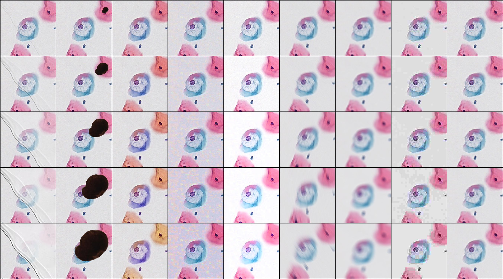
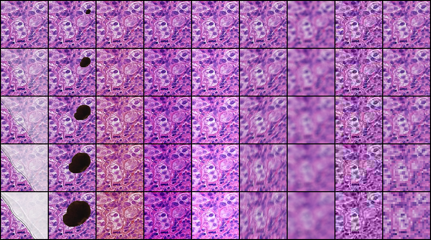

# **Benchmarking the Robustness of Deep Neural Networks to Common  Corruptions in Digital Pathology**. [[`arxiv`]](https://arxiv.org/abs/2206.14973)


This work can be used to evaluate how deep neural networks perform on corrupted pathology images. 
An example is show in `test.py`.

Applying our benchmark construction method to your own dataset only 
needs to define DistortDataset like the following usage.  

## usage:

```python
from utils import DistortImageFolder

distorted_dataset = DistortImageFolder(root='validation/set/root/of/Your/dataset/', method=distortion_name, severity=severity,transform=test_transform)
```

Note that the parameter setting of corruption cannot be appropriate for all tasks. Thus you can adjust the parameter to ensure that the corruption is close to reality and does not destroy all pathological information.

`plot_corrupted_sample.py` can be used to check whether the parameter is  reasonable  by visualizing one example.

These blow are the corrupted examples.

> **LocalTCT**
> 


> **Patchcamelyon**



## **Citation:**

```bibtex
@misc{https://doi.org/10.48550/arxiv.2206.14973,
  doi = {10.48550/ARXIV.2206.14973},
  url = {https://arxiv.org/abs/2206.14973},
  author = {Zhang, Yunlong and Sun, Yuxuan and Li, Honglin and Zheng, Sunyi and Zhu, Chenglu and Yang, Lin},
  keywords = {Computer Vision and Pattern Recognition (cs.CV), Artificial Intelligence (cs.AI), FOS: Computer and information sciences, FOS: Computer and information sciences},
  title = {Benchmarking the Robustness of Deep Neural Networks to Common Corruptions in Digital Pathology},
  publisher = {arXiv},
  year = {2022},
  copyright = {arXiv.org perpetual, non-exclusive license}
}
```

